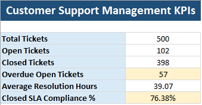
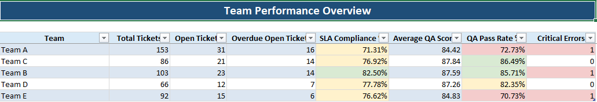
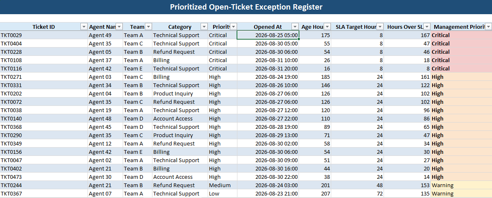

# Customer Support Analytics Automation

**Flagship project · Python + PostgreSQL · Synthetic data**

Turns customer-support ticket, agent, and QA records into SLA visibility, team performance analysis, prioritized cases, an automated Excel report, and an evidence-grounded management briefing.

**Demonstrated snapshot:** 500 tickets · 102 open · 57 overdue open · 5 Critical-priority overdue cases.

[Download the Excel report](reports/customer_support_management_report.xlsx) · [Read the management briefing](reports/management_briefing.txt) · [Review the SQL](sql/analysis_queries.sql)



## Business Problem

Support managers need to reconcile ticket workload, response obligations, and quality performance across separate records. A total-ticket count alone does not show which overdue cases need escalation or which teams need a closer review.

## Solution

```text
Synthetic CSV data → PostgreSQL tables and integrity constraints
→ SQL KPI and team analysis → prioritized open-ticket register
→ automated Excel report and deterministic management briefing
→ optional human-reviewed AI rewrite
```

The workflow connects reporting to decisions: identify urgent cases, compare SLA and QA performance, and direct follow-up to the teams with the strongest evidence of risk.

## Data

The included [source files](data/raw) contain **50 agents, 500 tickets, and 238 QA evaluations**, all synthetic. Ticket aging uses the generator's fixed snapshot of **1 September 2026, 12:00**, not the current date.

The [schema](sql/schema.sql) defines primary keys, foreign keys, typed fields, and required values. The [loader](src/load_database.py) converts CSV values and prints loaded row counts. SLA flags and age values are prepared by the data generator; this is a demonstration pipeline, not a connection to a live ticketing system.

## Analysis

- Open and closed workload, overdue open tickets, and average closed-ticket resolution time.
- **Closed-ticket SLA compliance:** closed tickets within SLA divided by all closed tickets.
- Team-level SLA compliance, average QA score, QA pass rate, and critical errors. Ticket and QA metrics are aggregated separately before joining by team.
- Open-ticket priorities: Critical overdue cases first, then High-priority overdue cases, cases at least 168 hours over SLA, other breached cases, and On Track cases. The register includes all open tickets.

## Decision Support

The saved [briefing](reports/management_briefing.txt) directs attention to five Critical overdue cases, Team A's overdue backlog and SLA performance, and Team E's QA pass rate. These findings support escalation, workload review, and investigation of coaching needs. They do not establish the causes of poor performance.

## Automated Action

Python scripts load the database, query reporting metrics, format the Excel workbook, produce a deterministic briefing, and prepare a [grounded AI prompt](reports/verified_ai_prompt.txt). A user runs the scripts in sequence. The optional rewrite is performed separately in an AI assistant and reviewed by a person; no AI API call, ticket reassignment, outbound notification, or scheduled execution is implemented here.

## Measured / Demonstrated Outcome

The committed CSVs, Excel report, and briefing agree on this snapshot:

| Measure | Result |
|---|---:|
| Total tickets | 500 |
| Open / closed tickets | 102 / 398 |
| Overdue open tickets | 57 |
| Closed-ticket SLA compliance | 76.38% |
| Average closed-ticket resolution | 39.07 hours |
| Critical-priority overdue open tickets | 5 |

Team A has 16 overdue open cases and 71.31% closed-ticket SLA compliance. Team E has a 70.73% QA pass rate. These are synthetic-data findings, not measured client improvements. The workflow makes the same metrics available for future management review; intervention outcomes have not been measured.

## Screenshots / Outputs

The [Excel workbook](reports/customer_support_management_report.xlsx) contains KPI Summary, Team Performance, and Exception Register sheets.





## Tools

Python, PostgreSQL, SQL, psycopg, openpyxl, and Excel. The optional AI stage uses a text prompt for a human-reviewed rewrite.

## How to Run

Download or clone this repository. Use a **dedicated local demonstration database**: the schema drops the three project tables, and the loader clears their contents before reloading.

1. Install Python and PostgreSQL. From the repository root, create a virtual environment and install the script dependencies:

   ```bash
   python -m venv .venv
   # Windows PowerShell: .\.venv\Scripts\Activate.ps1
   # macOS/Linux: source .venv/bin/activate
   python -m pip install "psycopg[binary]" openpyxl
   ```

2. Create the database and apply its schema using PostgreSQL's command-line tools (or run the equivalent steps in pgAdmin):

   ```bash
   createdb -h localhost -p 5432 -U postgres customer_support_analytics
   psql -h localhost -p 5432 -U postgres -d customer_support_analytics -f sql/schema.sql
   ```

3. Use the committed CSVs to reproduce the saved sample, then run:

   ```bash
   python src/load_database.py
   python src/generate_excel_report.py
   python src/generate_briefing.py
   python src/generate_ai_prompt.py
   ```

The database scripts prompt for the PostgreSQL password and use `localhost:5432`, user `postgres`, and database `customer_support_analytics`. If your local configuration differs, update the connection settings in each database script. Close the existing Excel report before overwriting it. Outputs are written to `reports/`.

The optional [data generators](src) create agents, tickets, and QA records in that order: `generate_data.py`, `generate_tickets.py`, `generate_qa.py`. They overwrite the sample CSVs. The main reporting path above does not require regenerating data.

---

[Portfolio overview](https://github.com/23-06109#selected-projects) · [LinkedIn](https://www.linkedin.com/in/jimmyjrmanalon)
